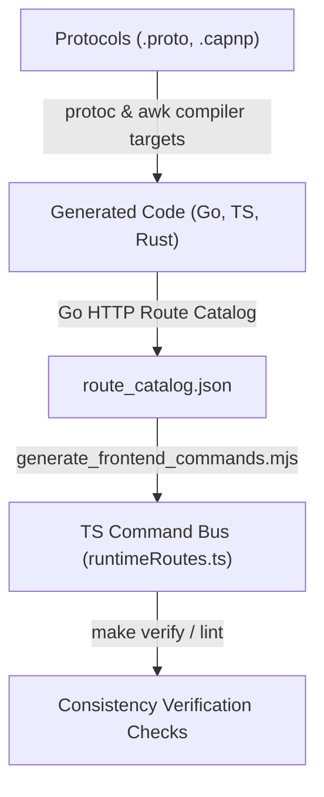

# Foundation Tooling & Verification Guide

Status: active reference
Version: 0.0.1
Date: 2026-06-28
Owner: Platform Architecture

## Introduction: Code and Contract Verification

The Ovasabi Foundation uses automated tooling, contract generation, and custom verification scripts to enforce architectural consistency across Go (backend), TypeScript (frontend), and Rust (high-performance compute/WASM).

Rather than relying on manual code review, all architectural rules, serialization boundaries, and performance expectations are turned into repeatable checks.



---

## Protocols: Formats & Compiler Targets

To eliminate API drift across different languages, the Foundation defines all cross-boundary communication as schemas that act as compiler targets.

### 1. Protobuf (Network and Event Envelope)

* **Format source**: `.proto` files located in `runtime-transport/protos/foundation/v1/` (`envelope.proto`, `metadata.proto`, `projection.proto`, `types.proto`).
* **Purpose**: Defines the network layout, event stream layout, tracing metadata (e.g., `CorrelationID`, `TenantID`), and progress-bearing transfer payloads.
* **Compiler Targets**:
  * **Go**: Compiled via `protoc-gen-go` to `runtime-transport/go/generated/`.
  * **TypeScript**: Compiled via `protoc` using the `ts-proto` plugin to `runtime-transport/ts/src/generated/` with browser options optimized for minimal allocation and native interoperability.
* **Generation command**: Running `make generate-contracts` automatically triggers `runtime-transport/scripts/generate_bindings.sh`.

### 2. Cap'n Proto (Shared-Memory WASM Buffer)

* **Format source**: `.capnp` files located in `runtime-sdk/protocols/system/v1/` (e.g., `runtime_buffer.capnp` defining the 4KB control-buffer, `runtime_shared_arena.capnp` defining WebAssembly memory layout).
* **Purpose**: Defines the precise hardware-aligned byte offsets and integers for zero-copy communication between the JavaScript host and WebAssembly/Rust guests.
* **Compiler Targets**:
  * Because parsing dynamic schema descriptors adds runtime overhead, the Cap'n Proto schemas are compiled directly into raw static constants.
  * The compiler script `runtime-sdk/scripts/generate_system_bindings.sh` uses an `awk` processor to parse the `.capnp` file constants and generate identical constant definitions in:
    * **Rust**: `runtime-sdk/rust/crates/ovrt-core/src/generated.rs`
    * **Go**: `runtime-sdk/go/runtimehost/generated/runtime_buffer_gen.go`
    * **TypeScript**: `runtime-sdk/ts/browser-host/src/generated/runtimeBuffer.ts`
  * As a result, the JS event loop, Go WASM runner, and Rust kernel operate on the exact same physical byte slots.

---

## Automatic Code Generation & Consistency

Beyond raw serialization compile targets, the Foundation uses automatic generators to ensure that application intent expressed in backend routes is instantly matched on the frontend.

### 1. Command & Route Registry Generator (`generate_frontend_commands.mjs`)

* **Source of truth**: The Go backend registers routes via `httpapi.MarshalRouteCatalog`. This catalog contains the actual live registered paths, HTTP methods, and required permissions (view, write, admin).
* **Process**: When `make generate-contracts` runs, the catalog is marshaled to `route_catalog.json`. The JavaScript generator `tooling/scripts/generate_frontend_commands.mjs` processes this JSON.
* **Output**: Writes `frontend/src/generated/runtimeRoutes.ts` (or corresponding path). It outputs:
  * A strongly-typed `RuntimeRoute[]` catalog.
  * A helper `createAppRouteRegistry()` function.
  * A union type `AppEventType` of all valid event channels.
* **Consistency Enforced**: The frontend routing and command bus (`createCommandBus`) are completely generated from the backend code. A developer cannot create an unregistered or untyped route.

### 2. Runtime Contract Manifest (`generate_runtime_contract_manifest.mjs`)

* **Process**: Scans the Cap'n Proto system schemas.
* **Output**: Generates `runtime-sdk/ts/browser-host/src/generated/runtimeContracts.ts`, mapping all schema files, IDs, and constants into a TypeScript manifest verified in the browser.

---

## Verification Script Matrix

All automated checks are run via `make lint` or specific `make check-*` targets. The source scripts live under `tooling/scripts/` in Core, and are copied to `scripts/checks/` in generated projects.

| Check Target | Script | Type | Description |
| --- | --- | --- | --- |
| **Scaffold & Update Sync** | | | |
| `check-scaffold-manifest` | `tests/scaffold_manifest_test.sh` | Shell | Asserts that `templates/scaffold.manifest.tsv` columns, modes, and features are structurally valid. |
| `check-init-project` | `tests/init_project_test.sh` | Shell | Simulates a fresh project initialization and checks files against the manifest. |
| `check-update-project` | `tests/update_project_test.sh` | Shell | Verifies that updating a project successfully replaces foundation code and deletes retired directories. |
| `check-scaffold-smoke` | `tests/scaffold_smoke_test.sh` | Shell | Performs a full build, lint, and test cycle on a newly generated scaffold. |
| **Enforcement & Policy** | | | |
| `check-coding-practices` | `coding_practices_check.sh` | Shell | Scans code against CP rules (e.g., CP-01 no uncontrolled recursion, CP-02 bounded loops, CP-03 function size limits). |
| `check-testing-practices` | `testing_practices_check.sh` | Shell | Enforces test adequacy rules and checks for generated event contract test files. |
| `check-go-concurrency-practices` | `go_concurrency_practices_check.sh` | Shell | Scans Go code for concurrency bugs: zero-duration timers, select-default close guards, and goroutine WaitGroup capture. |
| `check-practice-controls` | `practice_controls_check.sh` | Shell | Verifies that `tooling/practice_controls.psv` aligns perfectly with current documentation and scripts. |
| **Integrity & Drift** | | | |
| `check-contract-drift` | `contract_drift_check.sh` | Shell | Fails if compiled Go, Rust, or TS bindings are older than source `.proto` and `.capnp` schemas. |
| `check-doc-references` | `docs_reference_check.mjs` | Node | Validates relative Markdown links in all docs and rejects non-portable absolute `file://` URLs in repo files. |
| `check-agent-contract` | `agent_contract_check.sh` | Shell | Verifies that downstream projects retain the `agent_operating_contract.md`, evidence ledgers, and `AGENTS.md` rules. |
| `check-ovasabi-cli` | `go test ./cmd/ovasabi`; `node cmd/ovasabi/bin/ovasabi.js --help` | Go/Node | Verifies CLI scaffold wrapping, npm entrypoint launch, and online/offline license validation primitives. |
| `check-coverage-ratchet` | `coverage_ratchet_check.sh` | Shell | Enforces statement coverage floors per package (target >= 95% for new code) against `tooling/coverage_baseline.psv`. |
| `check-benchmark-evidence` | `benchmark_evidence_check.sh` | Shell | Fails when `docs/foundation_benchmarks.md` references a benchmark function, source path, or `benchmark-results/` artifact that no longer exists, keeping the evidence ledger honest across all lanes. |
| `check-server-kit-module-parity` | `server_kit_module_parity_check.sh` | Shell | In Core, verifies `tooling/server_kit_module_manifest.tsv` matches the real `server-kit/go` module surface both ways. In projects, verifies every vendored module arrived and every foundation-only module (e.g. `servicebacked`) was pruned. New modules get fleet verification by adding one manifest row. |

---

## Fleet Updates and Documentation Patches

When a development organization maintains multiple downstream applications (e.g., `trader_os`, `fintech_v1`), keeping them synchronized with core changes is critical to prevent code drift and framework decay.

The external distribution target is the Ovasabi CLI:

```bash
npx -y @ovasabi/cli init --profile=performance --name=trader_os
```

The CLI wraps the same manifest, patch, package-boundary, license, and
verification contracts described in [foundation_distribution.md](foundation_distribution.md).
The shell scripts below remain the compatibility fallback and must not drift
into a separate scaffold lifecycle.

### Fleet Synchronization (`update-all.sh`)

To update the entire fleet:

1. All active downstream projects are listed in `scaffolded-projects.tsv` in the parent directory of `foundation`.
2. Running the script `scripts/update-all.sh` iterates through this file and invokes the update routine for each project:

   ```bash
   ./foundation/scripts/update-all.sh --force
   ```

### Documentation Restructuring & Cleaning

To prevent project-level documentation drift, `scripts/update-project.sh` applies a strict synchronization policy:

* **Directory Purge**: The script runs `rm -rf "$PROJECT_PATH/docs/foundation"` before copying the core documentation.
* **Automatic Deletion**: If a documentation file is retired in Core (such as the deletion of `handover_note_codex.md` or `inos_runtime_reuse_plan.md` in version `0.0.1`), it is automatically deleted in the target project during the next update.

### Code Patches (`scaffold_managed_patches.sh`)

After files are copied, the foundation update runner executes `tooling/scripts/scaffold_managed_patches.sh`. This script applies inline code patches to target files that are project-owned or marked `create`/`force` mode:

* Upgrading Go versions in `Dockerfile`, `.env.example`, and `docker-compose.yml` configs.
* Correcting build targets in `docker-compose.yml` if the Dockerfile layers drift.
* Inserting the latest AI Agent read orders and workflow requirements into the target project's `AGENTS.md` and `README.md`.
* Restructuring Go workspaces (`go.work`) to include or exclude active submodules.

---

## The Relevance of Benchmarks

The Ovasabi Foundation requires all structural and runtime modifications to prove their optimization claims. These measurements are compiled in [docs/foundation_benchmarks.md](foundation_benchmarks.md).

Benchmarks are relevant to the application lifecycle in three ways:

1. **Ladder Verification**: They ensure that fast, direct pathways (same-process direct typed dispatch) do not pay network or JSON serialization costs.
2. **Allocation Enforcement**: The hotpaths must stay allocation-free at the unit boundary (e.g., progress readers, stream encoders). Benchmarks act as regression guards to catch accidental memory escapes in new PRs.
3. **Data-Lane Proofs**: They justify complex architectural shifts. For example, the Arrow-layout columnar rewrite for Hermes was only merged after benchmarks proved it yielded **24% faster scans**, **70% less memory usage**, and **99.6% fewer allocations** than the pointer-chase baseline.
