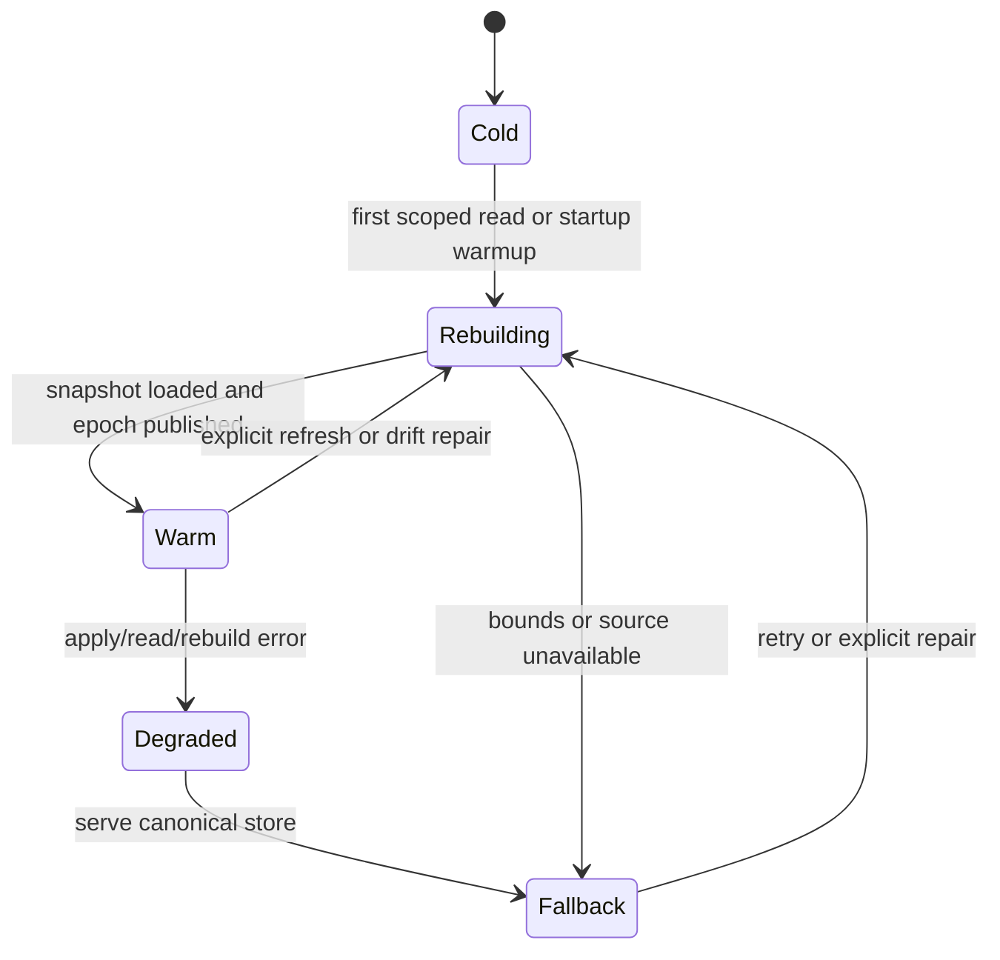

# Hermes Hotplane

Status: experimental implementation, mandatory scaffold wrapper
Date: 2026-05-26
Owner: Platform Architecture

## Purpose

Hermes is the Foundation hotplane: a bounded, node-local,
epoch-signaled projection layer for live operational reads. It is designed to
reduce repeated Postgres and Redis pressure without turning application memory
into a hidden source of truth.

The short rule:

```text
Postgres decides.
Redis coordinates.
Hermes remembers what this node needs right now.
Epochs tell local consumers when that memory changed.
```

The first implementation lives in `server-kit/go/hermes` and uses the generated
Foundation projection contract in
`runtime-transport/protos/foundation/v1/projection.proto`. It is not a replacement
for Postgres, River, Redis Streams, or materialized database read models. It is
a runtime refinement of the existing nervous-system lifecycle for reads that are
frequent, scoped, replayable, and safe to rebuild.

Freshness terminology, stale-window evidence, watermarks, replay, rebuild, and
fallback obligations are owned by `docs/projection_freshness_contract.md`.

## Position In The Foundation Lifecycle

Hermes sits after durable command truth:

```text
client command
-> RuntimeEnvelope
-> auth, tenant, correlation, idempotency validation
-> database.AtomicLane / executor helper
-> Postgres durable state plus outbox/job metadata
-> requested and terminal lifecycle events
-> River/worker or Redis Stream projector
-> Hermes partition apply
-> atomic epoch increment
-> local read, websocket, realtime, or runtime consumers
```

The write path remains boring and durable. Mutating commands still use
`server-kit/go/database` executors, Postgres constraints, idempotency keys, and
worker/job metadata. Hermes only consumes committed observations.

## Scaffold Automation

Generated projects route the scaffolded `database.RuntimeStore` through Hermes
by default. The mandatory path is still consistency-first:

1. `foundation/runtime-transport/protos/foundation/v1` is copied into
   `api/protos/foundation/v1` on `init-project` and `foundation-update`.
2. Legacy copied Foundation proto directories, `api/protos/transport` and
   `api/protos/hermes`, are removed during update.
3. `make communication-contracts` regenerates the shared Foundation Go and
   TypeScript bindings for `EventEnvelope`, `Metadata`, and
   `RecordMutationBatch`.
4. Startup wraps the canonical runtime store with `hermes.WrapRuntimeStore`,
   exposes `Dependencies.Hermes`, and registers Hermes health/resilience checks.
5. `make test-integration` inherits a Hermes smoke test that rebuilds a bounded
   projection from the Postgres `database.StateStore`, consumes a Foundation
   projection envelope from Redis Streams, checks the indexed read result, and
   leaves the same contract shape used by service-backed drift tests.
6. Product domains can still add specialized projectors with
   `foundation.v1.RecordMutationBatch`, but the generic StateStore hotplane is
   already active for all scaffolded apps. Command truth, authorization, and
   durable consistency remain Postgres/outbox-first.

## Architecture Roles

| Layer | Role | Non-role |
| --- | --- | --- |
| Postgres | Durable command truth, constraints, idempotency, audit, outbox, replay source. | It should not serve every repeated live read when a scoped projection is safe. |
| River/outbox | Durable follow-up work and replayable command side effects. | It should not become a low-latency read cache. |
| Redis | Cross-node coordination, Streams tailing, pub/sub invalidation, locks, leases, watermarks. | It should not store source-of-truth business records or become a per-read dependency for local hot state. |
| Hermes | Node-local live projection, indexed reads, realtime fanout state, epoch publication. | It must not accept uncommitted writes, own durable truth, or serve security-critical reads without a freshness fence. |

The Kafka inspiration is the log/projection discipline: partitioned streams,
offsets, high watermarks, compacted latest-value views, idempotent consumers,
and replay. Foundation should borrow that shape while using Postgres and Redis
for the durable and distributed pieces it already owns.

## Non-goals

1. No primary database replacement.
2. No cross-node consensus layer.
3. No unbounded in-memory mirror of Postgres.
4. No security-critical authorization truth without a freshness fence.
5. No app-owned ad hoc cache semantics outside Foundation metadata, tenant, and
   event lifecycle rules.
6. No generic JSON map hot path for routing, storage, or projection updates.
   Generic Hermes projection messages use protobuf `RecordMutationBatch`; app
   payload bytes inside a mutation may be Cap'n Proto, protobuf, or another
   declared binary frame.
7. No unbounded or silent partial projection. If a tenant/domain/collection
   scope exceeds the configured Hermes bounds, reads fall back to Postgres.

## Consistency Contract

Hermes may be stale only inside a documented freshness window. It must never be
semantically inconsistent.

## Lifecycle

Hermes projections move through a small operational lifecycle. This shape should
be visible in logs, health checks, and metrics.



State meanings:

| State | Meaning |
| --- | --- |
| `cold` | Projection is registered but has no authoritative local snapshot. |
| `rebuilding` | A bounded snapshot is being loaded from canonical storage. |
| `warm` | Reads may use Hermes subject to the requested freshness/fence mode. |
| `degraded` | Hermes detected an apply/read/rebuild fault for that scope. |
| `fallback` | Reads are served from canonical storage while Hermes recovers. |

Hermes must prefer correctness over cache hits. Fallback is not failure; silent
fallback with no metric is failure.

Required properties:

1. `HermesNoUncommittedTruth`: every applied mutation comes from a committed
   Postgres/outbox/River/Redis Stream observation.
2. `HermesTenantScopeStable`: partition keys include organization scope, and
   reads cannot cross tenant boundaries.
3. `HermesEpochMonotonic`: a partition epoch never moves backwards.
4. `HermesVersionMonotonic`: an older record version or source event cannot
   replace a newer one.
5. `HermesDeleteDominates`: a delete tombstone remains effective until a newer
   event for the same key appears.
6. `HermesFenceSatisfied`: fenced reads only answer when the partition has
   reached the required source watermark.
7. `HermesBoundedMemory`: records, bytes, descriptors, tombstones, indexes, and
   queues have explicit caps.
8. `HermesReplayable`: a partition can be dropped and rebuilt from Postgres plus
   the source stream.
9. `HermesFallbackRefinement`: fallback to Redis or Postgres returns the same
   semantic result or a controlled stale/unavailable error class.

Read modes:

The stable v1 behavior is owned by `docs/hermes_read_modes.md`. This table is a
summary only; changes to stable mode semantics require an ADR and a contract
version bump.

| Mode | Behavior |
| --- | --- |
| `fenced` | Requires a minimum source watermark, event ID, revision, or updated-at fence. If Hermes is behind, wait within a tiny bound, then fall back or fail visibly. |
| `live` | Returns current node-local projection with `epoch`, `source_watermark`, and `fresh_at` metadata. |
| `stale_while_revalidate` | Returns local projection when still inside the documented staleness budget and schedules refresh. |
| `postgres_required` | Bypasses Hermes for command acceptance, authorization-critical decisions, balances, uniqueness, and other durable invariants. |

Operational watch points:

1. Large `Rebuild` calls hold the publish gate while a partition snapshot is
   replaced. Readers spin with a hard bound and may return
   `ErrProjectionBusy`. Callers should treat that as a retry/fallback signal,
   not as data corruption.
2. `Rebuild` is a control-plane repair path over canonical storage. Routine
   pure-upsert projector ingestion should use `ApplyRecords`; trusted full
   snapshot replacement should use `BulkLoad`, which validates scope and bounds
   but skips per-event idempotency/tombstone bookkeeping.
3. Full-scan listing without an indexed filter pays `O(records * limit)` top-N
   insertion work. Production list paths should declare and use an indexed
   filter field for large scopes.
4. Index snapshots are layered and compact when delta depth crosses the bounded
   threshold. Churn-heavy projections should watch benchmark allocation and
   snapshot-depth behavior before promotion.
5. `Stats.ApproxBytes` is a guardrail, not an exact heap meter. Configure
   `MaxBytes` below the process memory ceiling because Go map overhead,
   alignment, and GC metadata are not included in the estimate.
6. Redis Stream tailers use non-blocking `XREADGROUP` reads. Real Redis treats
   `BLOCK 0` as wait forever, so service-backed tests must cover empty reads
   and pending-window behavior instead of relying only on the memory client.
7. Tailers apply before ack. If ack fails, pending entries are retried for the
   same consumer before new `>` messages are consumed. Cross-consumer recovery
   still requires a claim/lease policy before promotion to multi-consumer
   projector groups.

## Required Metrics

Every production app using Hermes should expose or log these counters from the
Foundation hotplane:

| Metric | Meaning |
| --- | --- |
| `projection_epoch` | Local published epoch for the projection. |
| `source_watermark` | Highest source version/watermark the projection has accepted. |
| `fallback_count` | Number of reads that had to use canonical storage instead of Hermes. |
| `rejected_applies` | Apply attempts rejected by invalid scope, stale version, bounds, or bad input. |
| `records` | Current record count in the projection. |
| `approx_bytes` | Approximate bounded memory used by record payloads. |
| `tombstones` | Current delete tombstone count. |
| `index_compactions` | Number of index snapshot compactions performed. |

These numbers are operationally more useful together than alone. A rising
fallback count with stable canonical latency means Hermes is protecting
correctness. A rising rejected-apply count means producer contracts or projection
bounds need attention. A widening gap between source watermark and durable
source progress means projector lag.

## Projection Spec

Hermes state must be declared before it exists.

```text
ProjectionSpec:
- name
- domain
- collection
- organization scope source
- source stream or outbox family
- rebuild query
- indexed fields
- order fields
- max records
- max bytes
- max indexes
- max tombstones
- ttl
- freshness budget
- read modes allowed
- auth/fence policy
- fallback policy
```

Projection specs should be generated or registered during startup with the same
discipline as route manifests and worker processors. A projection that has no
declared cap is invalid.

## Memory Model

Hermes should use the existing runtime vocabulary:

1. Small control state: atomics, counters, epochs, watermarks, queue depth, and
   pressure flags.
2. Descriptor/ring state for update batches and internal consumers.
3. Optional shared arena descriptors for larger byte or columnar payloads.
4. Public APIs that return defensive copies.
5. Internal APIs that return borrowed views with explicit lifetime rules.

The first implementation does not need unsafe public APIs. It can use Go
atomics and `atomic.Value`/typed atomic pointers for snapshot publication,
while keeping borrowed views internal to Hermes-owned callbacks.

The current `server-kit/go/hermes` slice uses writer-owned apply locks plus
segmented atomic snapshots for records and indexes. Public reads copy
`database.DomainRecord` values. Internal `ForEachView` reads return
callback-lifetime borrowed views and are allocation-free in the current
benchmark baseline. A bounded atomic publish gate prevents readers from seeing
partially published record/index state without putting readers on the writer
mutex.

Recommended partition structure:

```text
HermesPartition:
- key: organization/domain/collection/shard
- source watermark
- atomic epoch
- active snapshot pointer
- writer-owned apply queue
- bounded tombstone table
- index registry
- memory accounting
- pressure state
```

Recommended snapshot structure:

```text
HermesSnapshot:
- generation
- source watermark
- record table
- scoped/order indexes
- scalar filter indexes
- descriptor references for large payloads
- approximate byte accounting
```

Readers load the active snapshot and read without blocking projector writes.
Projectors apply committed event batches to an inactive builder or delta segment
and publish by atomically swapping the active snapshot pointer, then incrementing
the partition epoch.

For high-frequency projections, use ping-pong or segmented snapshots:

1. Writer applies to inactive segment.
2. Writer seals the segment.
3. Writer atomically publishes the segment list/generation.
4. Writer increments epoch.
5. Readers observe the new generation.
6. Old segments are released after the reader epoch window closes.

This follows the useful `inos_v1` lesson: memory can be a communication medium
only when offset ownership, epoch signaling, and snapshot lifetime are explicit.

## Zero-copy And Copy-safe APIs

Hermes needs two API families.

Internal hot APIs:

```text
GetView(ctx, key, fence) -> borrowed record view
ListViewsInto(ctx, query, dst, fence) -> borrowed views in caller-owned slice
ForEachView(ctx, query, fn, fence) -> callback-lifetime borrowed views
WatchEpoch(partition, lastEpoch) -> epoch change notification
```

Public safe APIs:

```text
GetRecord(ctx, key, fence) -> copied DomainRecord
ListRecords(ctx, query, limit, fence) -> copied []DomainRecord
GetRecordBytes(ctx, key, codec, fence) -> copied binary frame bytes
ApplyRecords(ctx, records) -> incremental pure-upsert projector batch
BulkLoad(ctx, records) -> trusted full snapshot replacement
```

Internal consumers such as websocket fanout, local realtime stores, and runtime
descriptor planners should use borrowed views. HTTP handlers and app services
that may retain results should use copied records.

Mutation APIs are deliberately split. `ApplyBatch` is the durable event path for
mixed operations, deletes, idempotency, and source correlation. `ApplyRecords`
is the faster path when a projector already has validated `DomainRecord`
upserts. `BulkLoad` replaces a partition from a trusted snapshot and is the
right primitive for rebuild/repair seeding after the canonical source has been
read; it is not a command-acceptance path and does not make Hermes durable
truth.

Transport codecs are intentionally layered. Hermes owns the generic projection
contract, `foundation.v1.RecordMutationBatch`, and consumes it through the
Foundation `EventEnvelope`. App-specific command/event schemas remain app-owned.
If a projector needs to carry the original app event, it stores those bytes in
`RecordMutation.payload` with `payload_encoding` set to `CAPNP`, `PROTOBUF`, or
`BINARY`; Hermes indexes only the typed projection fields.

Hermes is not a log-text consumer. Operational logs remain human/operator
diagnostics through the Foundation logger facade. Durable facts intended for
replay, rebuild, drift repair, workers, analytics, or Hermes must be stored in
`foundation_event_log` through `server-kit/go/eventlog` and published as typed
terminal envelopes, preferably protobuf or Cap'n Proto payloads inside the
Foundation binary envelope. This keeps Redis Streams as a short delivery window,
Postgres/River/outbox as the durable replay lane, and Hermes as a disposable hot
projection.

## Redis Synergy

Hermes should reduce Redis pressure, not compete with Redis.

Use Redis for:

1. Stream tailing when an app wants cross-node ephemeral fanout.
2. Pub/sub invalidation and wakeups.
3. Projection ownership leases during rebuild.
4. Per-partition source watermarks and node heartbeats.
5. Cluster-level backpressure hints.
6. Miss coalescing when a local node must hydrate the same key family.

The first implementation exposes three source shapes:

1. `MessageSource` plus `Tailer` for explicit event decoding.
2. `EnvelopeSource` plus `EnvelopeTailer` for Foundation binary
   `EventEnvelope` messages carrying `foundation.v1.RecordMutationBatch`.
3. `PayloadSource` plus `PayloadTailer` for lower-level byte adapters.

`RedisStreamSource`, `RedisStreamEnvelopeSource`, and `RedisStreamPayloadSource`
adapt the Foundation Redis client. Outbox tailing should implement the same
source interfaces rather than adding a second projection path.

Avoid using Redis for:

1. Every local hot read.
2. Durable business truth.
3. Large per-record mirrors when Hermes already holds a node-local projection.
4. Broad wildcard scans in product hot paths.

Failure behavior:

1. Redis unavailable: Hermes may continue serving unfenced reads inside the
   freshness budget, but fenced or auth-sensitive reads fall back to Postgres or
   fail closed.
2. Redis lagging: projectors expose lag and stop claiming fresh reads when the
   source watermark stalls.
3. Redis stream trim gap: partition enters `rebuild_required` and snapshots
   from Postgres before serving fenced reads again.

## Postgres Synergy

Hermes depends on Postgres read shapes being correct. Rebuild queries must keep
the database rules:

1. Tenant predicate required.
2. Explicit projection columns.
3. Explicit order.
4. Finite limit or bounded chunk loop.
5. Keyset pagination for broad rebuilds.
6. Query budget from `DefaultPoolOptionsFor`.
7. No external calls inside transactions.

The durable write path should use one of these patterns:

1. `AtomicLane` writes state plus outbox/job metadata in one transaction.
2. `EnqueueTx` persists a River job inside the command transaction where needed.
3. A projector consumes the committed event/job, applies to Hermes, and records
   the source watermark.

Hermes should never be updated from an app handler before the durable write
commits.

## Concurrency Model

Recommended defaults:

1. Partition-owned projector goroutine or bounded worker per shard family.
2. Bounded apply queues with explicit reject/degrade behavior.
3. Batch apply for event bursts.
4. No locks held across callbacks, Redis calls, Postgres calls, or worker
   enqueue.
5. Atomic epoch publication after state is fully visible.
6. Shutdown drains or marks partitions stale within a finite timeout.
7. Race tests for every shared-memory or borrowed-view path.

Projector action grain:

```text
Read source batch
-> validate metadata and tenant scope
-> apply idempotently to inactive builder/delta
-> publish snapshot
-> epoch++
-> ack source batch
```

Acking before publish is a data-loss bug. Publishing before validation is a
tenant/safety bug. Blocking readers during network calls is a latency bug.

## Websocket Scaling Lessons

Hermes should reuse the websocket scaling posture instead of inventing a
separate operational model:

1. Treat projections as state machines with visible outcomes: read served,
   stale read served, fallback used, read rejected, event applied, event
   skipped, or partition rebuilt.
2. Keep hidden state explicit: local record maps, index snapshots, apply
   queues, source watermarks, Redis stream IDs, and epoch generations.
3. Bound every queue and wait just like websocket write queues, ping/pong
   deadlines, and dispatch acquire timeouts.
4. Prefer local lookup for the common path. Redis should route, wake, lease, and
   coordinate; it should not be on every healthy hot read.
5. Degrade visibly when Redis is unavailable. Unfenced live reads may continue
   inside the freshness budget; fenced reads fall back or fail closed.
6. Publish low-cardinality metrics early so pressure decisions are based on
   queue depth, lag, records, bytes, rejects, and fallback counts.

## Memory Bounds

Hermes must be aggressively bounded.

Required caps:

1. Process total bytes.
2. Partition bytes.
3. Partition record count.
4. Index count.
5. Field cardinality per index.
6. Tombstone count and tombstone TTL.
7. Apply queue depth.
8. Watcher count.
9. Descriptor count.
10. Rebuild batch size.
11. Bulk-load snapshot size.

Eviction policy should prefer:

1. Expired TTL records.
2. Stale inactive tenants.
3. Unwatched projections.
4. Cold optional indexes.
5. Full partition drop and rebuild over partial unsafe mutation.

If memory pressure cannot be resolved inside the cap, Hermes should mark the
projection degraded and fall back to Redis/Postgres according to the projection
policy. It should not grow until the process is unhealthy.

## Observability

Hermes metrics should be low-cardinality and partition-family scoped:

1. `hermes.read.hit`
2. `hermes.read.miss`
3. `hermes.read.stale`
4. `hermes.read.fallback`
5. `hermes.apply.batch`
6. `hermes.apply.duplicate`
7. `hermes.apply.older_version`
8. `hermes.apply.tombstone`
9. `hermes.partition.epoch`
10. `hermes.partition.lag`
11. `hermes.partition.bytes`
12. `hermes.partition.records`
13. `hermes.partition.evicted`
14. `hermes.partition.rebuild_required`
15. `hermes.queue.depth`
16. `hermes.queue.rejected`

Trace records should include correlation ID when the source event has one,
source event ID, source watermark, organization ID, projection name, action,
state, and fallback decision.

## Benchmark Plan

Phase 0 baseline uses the existing MemoryDB, websocket, worker, chain, and
event-bus benchmarks:

```bash
cd foundation/server-kit/go
go test -run=^$ -bench='Benchmark(MemoryDB|Scale_|Scale1M_|ExecCommandMemoryDB|Engine_Enqueue|Job_Normalize|RunParallel)' -benchmem ./database ./appbench ./worker ./chain
```

Phase 1 Hermes-specific benchmarks:

1. `BenchmarkHermesGetView`
2. `BenchmarkHermesGetRecordCopied`
3. `BenchmarkHermesListViewsIntoLimit50`
4. `BenchmarkHermesListRecordsCopiedLimit50`
5. `BenchmarkHermesApplyEventUpsert`
6. `BenchmarkHermesApplyEventDelete`
7. `BenchmarkHermesApplyBatch64`
8. `BenchmarkHermesApplyBatch1024`
9. `BenchmarkHermesApplyRecords64`
10. `BenchmarkHermesBulkLoad512`
11. `BenchmarkHermesApplyRecordPayloads64`
12. `BenchmarkHermesPublishEpoch`
13. `BenchmarkHermesWatchEpoch`
14. `BenchmarkHermesFallbackPostgres`
15. `BenchmarkHermesRedisStreamTail`
16. `BenchmarkHermesSnapshotRebuild100K`
17. `BenchmarkHermesSnapshotRebuild1M`
18. `BenchmarkHermesDriftCheckMerkle`

Promotion targets should be evidence-based, but the first local guardrails are:

1. Internal hot key read: below 1000 ns and zero allocation.
2. Internal indexed list into caller storage: below 10000 ns for limit 50 at
   1M records and zero allocation where payload copies are not requested.
3. Public copied list: no worse than current MemoryDB copy-safe API unless the
   projection stores wider payloads by design.
4. Apply event: below 5000 ns for compact records.
5. Batch apply: amortized event cost below Redis pipelined per-key cost.
6. Epoch publish: below 500 ns.
7. No unbounded heap growth under churn.
8. Race tests pass for projector/read concurrency.

## Implementation Sequence

1. Document projection specs and invariants.
2. Add a `server-kit/go/hermes` experimental package behind tests.
3. Implement partition metadata, epochs, memory accounting, and copied APIs.
4. Add internal borrowed view APIs and benchmarks.
5. Add idempotent apply with version/tombstone rules.
6. Add snapshot rebuild from `database.StateStore`.
7. Add Redis Stream tailer using `redis.Client` and bounded worker ownership.
8. Add binary payload tailing for Cap'n Proto/protobuf/runtime-frame decoders
   without adding JSON to the Hermes transport lane.
9. Add Foundation envelope tailing for generated
   `foundation.v1.RecordMutationBatch` contracts.
10. Add drift checks: count parity, sampled hashes, and partition hash/Merkle
    witnesses.
11. Add integration tests against service-backed Postgres and Redis.
12. Wire selected product-specific read paths only after benchmark and parity
    evidence.

The scaffolded `database.RuntimeStore` wrapper is now mandatory. Promotion of
additional domain-specific read paths still requires proof that Hermes refines
the ordinary Postgres-backed read path under tenant isolation, version ordering,
deletes, staleness, replay, rebuild, Redis loss, and memory pressure.
